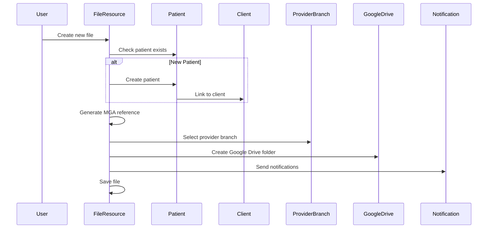
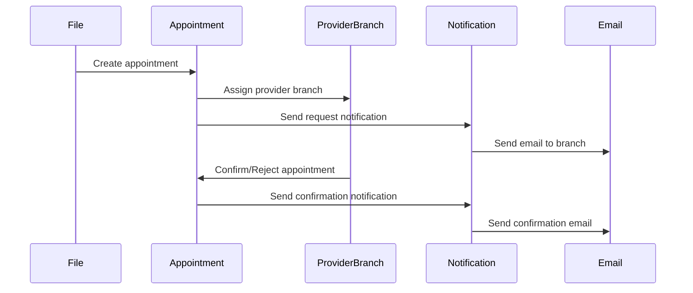
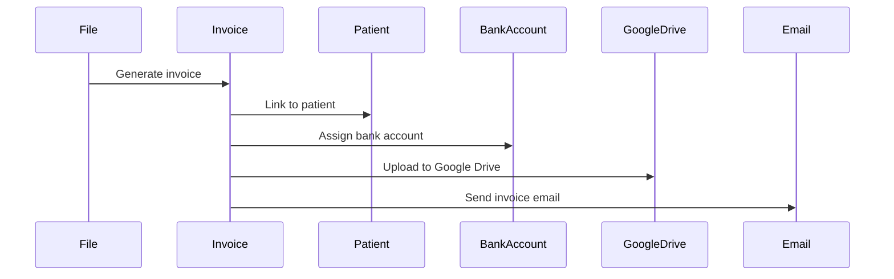

# MGA System Workflow Documentation

> 🛠 Auto-Update Note: This document is automatically generated and maintained by the system workflow generator.

## Table of Contents

1. [Project Overview](#1-project-overview)
2. [Versions & Environment](#2-versions--environment)
3. [Database Schema](#3-database-schema)
4. [Eloquent Models](#4-eloquent-models)
5. [Filament (Panels & Admin UI)](#5-filament-panels--admin-ui)
6. [Livewire Components & Blade](#6-livewire-components--blade)
7. [Routing & Controllers](#7-routing--controllers)
8. [Domain Workflows](#8-domain-workflows)
9. [Jobs, Events, Listeners, Notifications, Mailables, Schedules](#9-jobs-events-listeners-notifications-mailables-schedules)
10. [Policies & Permissions](#10-policies--permissions)
11. [Services & Integrations](#11-services--integrations)
12. [Configuration Highlights](#12-configuration-highlights)
13. [Testing](#13-testing)
14. [Known Limitations & TODOs](#14-known-limitations--todos)

---

## 1. Project Overview

The MGA System is a comprehensive medical assistance and provider relationship management platform built on Laravel 11.4 with Filament 3. The system serves as a centralized hub for managing medical cases, provider networks, client relationships, and financial operations across multiple countries.

**Core Domains:**
- **CRM**: Client and lead management, contact tracking, relationship management
- **PRM**: Provider and branch management, service type coordination, availability tracking
- **Ops**: File/case management, appointment scheduling, medical report handling
- **Workflow**: Task management, interaction tracking, notification systems
- **Finance**: Invoicing, billing, transaction management, payment tracking
- **System**: User management, permissions, audit trails, integrations

**High-level Module Map:**
```
MGA System
├── Client Management (CRM)
│   ├── Companies & Agencies
│   ├── Lead Tracking
│   └── Contact Management
├── Provider Network (PRM)
│   ├── Provider Management
│   ├── Branch Operations
│   └── Service Coordination
├── Case Management (Ops)
│   ├── File Processing
│   ├── Appointment Scheduling
│   └── Medical Documentation
├── Financial Operations
│   ├── Invoicing System
│   ├── Payment Processing
│   └── Transaction Tracking
└── System Administration
    ├── User Management
    ├── Permissions & Roles
    └── Integration Services
```

---

## 2. Versions & Environment

### Core Framework Versions
- **PHP**: ^8.2
- **Laravel**: ^11.31
- **Filament**: ^3.2
- **Livewire**: ^3.0
- **Node.js**: Not specified (Vite-based frontend)
- **Database**: SQLite (development), MySQL/PostgreSQL (production)

### Key Package Versions
| Package | Version | Purpose |
|---------|---------|---------|
| `filament/filament` | ^3.2 | Admin panel framework |
| `filament/infolists` | ^3.2 | Information display components |
| `filament/notifications` | ^3.3 | Notification system |
| `livewire/livewire` | ^3.0 | Reactive components |
| `spatie/laravel-permission` | ^6.16 | Role and permission management |
| `spatie/laravel-google-calendar` | ^3.8 | Google Calendar integration |
| `google/apiclient` | ^2.18 | Google API client |
| `twilio/sdk` | ^8.3 | SMS/WhatsApp messaging |
| `stripe/stripe-php` | ^17.2 | Payment processing |
| `maatwebsite/excel` | ^3.1 | Excel import/export |
| `barryvdh/laravel-dompdf` | ^3.1 | PDF generation |
| `staudenmeir/eloquent-has-many-deep` | ^1.20 | Deep relationship queries |

### Frontend Tooling
- **Vite**: ^6.0.11 (Build tool)
- **Tailwind CSS**: ^3.4.0 (Styling)
- **Axios**: ^1.7.4 (HTTP client)
- **Laravel Vite Plugin**: ^1.2.0 (Laravel integration)

### Development Tools
- **Laravel Blueprint**: ^2.11 (Code generation)
- **Laravel Pint**: ^1.13 (Code formatting)
- **PHPUnit**: ^11.0.1 (Testing)
- **Faker**: ^1.23 (Test data generation)

---

## 3. Database Schema

### Core Tables

#### users
| Column | Type | Nullable | Default | Index/Unique | Foreign Key |
|--------|------|----------|---------|--------------|-------------|
| id | bigint | No | auto_increment | PRIMARY | - |
| name | varchar(255) | No | - | - | - |
| email | varchar(255) | No | - | UNIQUE | - |
| email_verified_at | timestamp | Yes | null | - | - |
| password | varchar(255) | No | - | - | - |
| two_factor_secret | text | Yes | null | - | - |
| two_factor_recovery_codes | text | Yes | null | - | - |
| two_factor_confirmed_at | timestamp | Yes | null | - | - |
| smtp_host | varchar(255) | Yes | null | - | - |
| smtp_port | varchar(255) | Yes | null | - | - |
| smtp_username | varchar(255) | Yes | null | - | - |
| smtp_password | varchar(255) | Yes | null | - | - |
| signature_image | varchar(255) | Yes | null | - | - |
| remember_token | varchar(100) | Yes | null | - | - |
| created_at | timestamp | Yes | null | - | - |
| updated_at | timestamp | Yes | null | - | - |

#### clients
| Column | Type | Nullable | Default | Index/Unique | Foreign Key |
|--------|------|----------|---------|--------------|-------------|
| id | bigint | No | auto_increment | PRIMARY | - |
| company_name | varchar(255) | No | - | - | - |
| type | enum | No | - | - | - |
| status | enum | No | - | - | - |
| initials | varchar(10) | No | - | - | - |
| number_requests | int | No | - | - | - |
| gop_contact_id | bigint | Yes | null | - | → contacts.id |
| operation_contact_id | bigint | Yes | null | - | → contacts.id |
| financial_contact_id | bigint | Yes | null | - | → contacts.id |
| phone | varchar(255) | Yes | null | - | - |
| email | varchar(255) | Yes | null | - | - |
| created_at | timestamp | Yes | null | - | - |
| updated_at | timestamp | Yes | null | - | - |

**Enums:**
- `type`: "Assistance", "Insurance", "Agency"
- `status`: "Searching", "Interested", "Sent", "Rejected", "Active", "On Hold", "Closed", "Broker", "No Reply"

#### patients
| Column | Type | Nullable | Default | Index/Unique | Foreign Key |
|--------|------|----------|---------|--------------|-------------|
| id | bigint | No | auto_increment | PRIMARY | - |
| name | varchar(255) | No | - | - | - |
| client_id | bigint | No | - | - | → clients.id |
| dob | date | Yes | null | - | - |
| gender | varchar(255) | Yes | null | - | - |
| country_id | bigint | Yes | null | - | → countries.id |
| gop_contact_id | bigint | Yes | null | - | → contacts.id |
| operation_contact_id | bigint | Yes | null | - | → contacts.id |
| financial_contact_id | bigint | Yes | null | - | → contacts.id |
| created_at | timestamp | Yes | null | - | - |
| updated_at | timestamp | Yes | null | - | - |

#### files
| Column | Type | Nullable | Default | Index/Unique | Foreign Key |
|--------|------|----------|---------|--------------|-------------|
| id | bigint | No | auto_increment | PRIMARY | - |
| mga_reference | varchar(255) | No | - | UNIQUE | - |
| patient_id | bigint | No | - | - | → patients.id |
| service_type_id | bigint | No | - | - | → service_types.id |
| status | varchar(255) | No | "New" | - | - |
| client_reference | varchar(255) | Yes | null | - | - |
| country_id | bigint | Yes | null | - | → countries.id |
| city_id | bigint | Yes | null | - | → cities.id |
| provider_branch_id | bigint | Yes | null | - | → provider_branches.id |
| service_date | date | Yes | null | - | - |
| service_time | time | Yes | null | - | - |
| address | varchar(255) | Yes | null | - | - |
| symptoms | text | Yes | null | - | - |
| diagnosis | text | Yes | null | - | - |
| contact_patient | varchar(255) | Yes | "Client" | - | - |
| google_drive_link | text | Yes | null | - | - |
| email | varchar(255) | Yes | null | - | - |
| phone | varchar(255) | Yes | null | - | - |
| created_at | timestamp | Yes | null | - | - |
| updated_at | timestamp | Yes | null | - | - |

#### providers
| Column | Type | Nullable | Default | Index/Unique | Foreign Key |
|--------|------|----------|---------|--------------|-------------|
| id | bigint | No | auto_increment | PRIMARY | - |
| country_id | bigint | No | - | - | → countries.id (onDelete: cascade) |
| status | enum | No | - | - | - |
| type | enum | No | - | - | - |
| name | varchar(255) | No | - | UNIQUE | - |
| payment_due | int | Yes | null | - | - |
| payment_method | enum | Yes | null | - | - |
| comment | text | Yes | null | - | - |
| gop_contact_id | bigint | Yes | null | - | → contacts.id |
| operation_contact_id | bigint | Yes | null | - | → contacts.id |
| financial_contact_id | bigint | Yes | null | - | → contacts.id |
| phone | varchar(255) | Yes | null | - | - |
| email | varchar(255) | Yes | null | - | - |
| created_at | timestamp | Yes | null | - | - |
| updated_at | timestamp | Yes | null | - | - |

**Enums:**
- `status`: "Active", "Hold", "Potential", "Black"
- `type`: "Doctor", "Hospital", "Clinic", "Dental", "Agency"
- `payment_method`: "Online Link", "Bank Transfer", "AEAT"

#### provider_branches
| Column | Type | Nullable | Default | Index/Unique | Foreign Key |
|--------|------|----------|---------|--------------|-------------|
| id | bigint | No | auto_increment | PRIMARY | - |
| provider_id | bigint | No | - | - | → providers.id |
| branch_name | varchar(255) | No | - | - | - |
| city_id | bigint | Yes | null | - | → cities.id (onDelete: set null) |
| all_country | boolean | No | false | - | - |
| status | enum | No | - | - | - |
| priority | int | No | - | - | - |
| service_types | varchar(255) | Yes | null | - | - |
| communication_method | varchar(50) | Yes | null | - | - |
| day_cost | decimal(8,2) | Yes | null | - | - |
| night_cost | decimal(8,2) | Yes | null | - | - |
| weekend_cost | decimal(8,2) | Yes | null | - | - |
| weekend_night_cost | decimal(8,2) | Yes | null | - | - |
| created_at | timestamp | Yes | null | - | - |
| updated_at | timestamp | Yes | null | - | - |

**Enums:**
- `status`: "Active", "Hold"

#### appointments
| Column | Type | Nullable | Default | Index/Unique | Foreign Key |
|--------|------|----------|---------|--------------|-------------|
| id | bigint | No | auto_increment | PRIMARY | - |
| file_id | bigint | No | - | - | → files.id (onDelete: cascade) |
| provider_branch_id | bigint | No | - | - | → provider_branches.id (onDelete: cascade) |
| service_date | date | No | - | - | - |
| service_time | time | Yes | null | - | - |
| status | varchar(255) | No | "Requested" | - | - |
| created_at | timestamp | Yes | null | - | - |
| updated_at | timestamp | Yes | null | - | - |

#### invoices
| Column | Type | Nullable | Default | Index/Unique | Foreign Key |
|--------|------|----------|---------|--------------|-------------|
| id | bigint | No | auto_increment | PRIMARY | - |
| name | varchar(255) | No | - | UNIQUE | - |
| patient_id | bigint | No | - | - | → patients.id (onDelete: cascade) |
| bank_account_id | bigint | Yes | null | - | → bank_accounts.id (onDelete: cascade) |
| due_date | date | No | - | - | - |
| total_amount | decimal(15,2) | No | - | - | - |
| discount | decimal(15,2) | No | 0 | - | - |
| tax | decimal(15,2) | No | 0 | - | - |
| status | varchar(255) | No | - | - | - |
| payment_date | date | Yes | null | - | - |
| transaction_id | bigint | Yes | null | - | → transactions.id (onDelete: set null) |
| paid_amount | decimal(15,2) | Yes | null | - | - |
| invoice_google_link | text | Yes | null | - | - |
| invoice_date | date | Yes | null | - | - |
| file_id | bigint | Yes | null | - | → files.id |
| payment_link | varchar(255) | Yes | null | - | - |
| created_at | timestamp | Yes | null | - | - |
| updated_at | timestamp | Yes | null | - | - |

### Pivot Tables

#### branch_services
| Column | Type | Nullable | Default | Index/Unique | Foreign Key |
|--------|------|----------|---------|--------------|-------------|
| id | bigint | No | auto_increment | PRIMARY | - |
| provider_branch_id | bigint | No | - | - | → provider_branches.id |
| service_type_id | bigint | No | - | - | → service_types.id |
| cost | decimal(8,2) | No | - | - | - |
| is_active | boolean | No | true | - | - |
| created_at | timestamp | Yes | null | - | - |
| updated_at | timestamp | Yes | null | - | - |

#### branch_cities
| Column | Type | Nullable | Default | Index/Unique | Foreign Key |
|--------|------|----------|---------|--------------|-------------|
| id | bigint | No | auto_increment | PRIMARY | - |
| provider_branch_id | bigint | No | - | - | → provider_branches.id |
| city_id | bigint | No | - | - | → cities.id |
| created_at | timestamp | Yes | null | - | - |
| updated_at | timestamp | Yes | null | - | - |

### Additional Tables

#### contacts
| Column | Type | Nullable | Default | Index/Unique | Foreign Key |
|--------|------|----------|---------|--------------|-------------|
| id | bigint | No | auto_increment | PRIMARY | - |
| name | varchar(255) | No | - | - | - |
| email | varchar(255) | Yes | null | - | - |
| phone | varchar(255) | Yes | null | - | - |
| preferred_contact | enum | No | - | - | - |
| created_at | timestamp | Yes | null | - | - |
| updated_at | timestamp | Yes | null | - | - |

**Enums:**
- `preferred_contact`: "Email", "Phone", "WhatsApp"

#### countries
| Column | Type | Nullable | Default | Index/Unique | Foreign Key |
|--------|------|----------|---------|--------------|-------------|
| id | bigint | No | auto_increment | PRIMARY | - |
| name | varchar(255) | No | - | - | - |
| code | varchar(2) | No | - | - | - |
| created_at | timestamp | Yes | null | - | - |
| updated_at | timestamp | Yes | null | - | - |

#### cities
| Column | Type | Nullable | Default | Index/Unique | Foreign Key |
|--------|------|----------|---------|--------------|-------------|
| id | bigint | No | auto_increment | PRIMARY | - |
| name | varchar(255) | No | - | - | - |
| country_id | bigint | No | - | - | → countries.id |
| province_id | bigint | Yes | null | - | → provinces.id |
| created_at | timestamp | Yes | null | - | - |
| updated_at | timestamp | Yes | null | - | - |

#### service_types
| Column | Type | Nullable | Default | Index/Unique | Foreign Key |
|--------|------|----------|---------|--------------|-------------|
| id | bigint | No | auto_increment | PRIMARY | - |
| name | varchar(255) | No | - | - | - |
| created_at | timestamp | Yes | null | - | - |
| updated_at | timestamp | Yes | null | - | - |

---

## 4. Eloquent Models

### Core Models

#### File Model
```php
class File extends Model
{
    protected $fillable = [
        'status', 'mga_reference', 'patient_id', 'client_reference',
        'country_id', 'city_id', 'service_type_id', 'provider_branch_id',
        'service_date', 'service_time', 'address', 'symptoms', 'diagnosis',
        'contact_patient', 'google_drive_link', 'email', 'phone'
    ];

    protected $casts = [
        'id' => 'integer',
        'patient_id' => 'integer',
        'country_id' => 'integer',
        'city_id' => 'integer',
        'service_type_id' => 'integer',
        'provider_branch_id' => 'integer',
        'service_date' => 'date'
    ];

    // Relationships
    public function patient(): BelongsTo
    public function client(): BelongsTo
    public function country(): BelongsTo
    public function city(): BelongsTo
    public function serviceType(): BelongsTo
    public function providerBranch(): BelongsTo
    public function medicalReports(): HasMany
    public function gops(): HasMany
    public function prescriptions(): HasMany
    public function appointments(): HasMany
    public function comments(): HasMany
    public function tasks(): MorphMany
    public function bankAccounts(): HasMany
    public function bills(): HasMany
    public function invoices(): HasMany

    // Business Logic Methods
    public function getBranchServicesForServiceType()
    public function gopInTotal()
    public function gopOutTotal()
    public function gopTotal()
    public function createGoogleMeetLink()
    public static function generateMGAReference($clientId, $type)
}
```

#### Patient Model
```php
class Patient extends Model
{
    use HasFactory, HasContacts, NotifiableEntity;

    protected $fillable = [
        'name', 'client_id', 'dob', 'gender', 'country_id',
        'gop_contact_id', 'operation_contact_id', 'financial_contact_id'
    ];

    protected $casts = [
        'id' => 'integer',
        'client_id' => 'integer',
        'dob' => 'date'
    ];

    // Relationships
    public function files(): HasMany
    public function client(): BelongsTo
    public function country(): BelongsTo
    public function tasks(): MorphMany
    public function gopContact(): BelongsTo
    public function operationContact(): BelongsTo
    public function financialContact(): BelongsTo

    // Accessors
    public function getFilesCountAttribute()
}
```

#### Client Model
```php
class Client extends Model
{
    use HasFactory, HasContacts, NotifiableEntity;

    protected $fillable = [
        'company_name', 'type', 'status', 'initials', 'number_requests',
        'gop_contact_id', 'operation_contact_id', 'financial_contact_id',
        'phone', 'email'
    ];

    // Relationships
    public function bankAccounts(): HasMany
    public function leads(): HasMany
    public function patients(): HasMany
    public function gopContact(): BelongsTo
    public function operationContact(): BelongsTo
    public function financialContact(): BelongsTo
    public function tasks(): MorphMany

    // Accessors
    public function getNameAttribute()
}
```

#### Provider Model
```php
class Provider extends Model
{
    use HasFactory, HasRelationships;

    protected $fillable = [
        'country_id', 'status', 'type', 'name', 'payment_due',
        'payment_method', 'comment', 'gop_contact_id', 'operation_contact_id',
        'financial_contact_id', 'phone', 'email'
    ];

    // Relationships
    public function country(): BelongsTo
    public function branches(): HasMany
    public function leads(): HasMany
    public function latestLead(): HasOne
    public function tasks(): MorphMany
    public function gopContact(): BelongsTo
    public function operationContact(): BelongsTo
    public function financialContact(): BelongsTo
}
```

#### ProviderBranch Model
```php
class ProviderBranch extends Model
{
    protected $fillable = [
        'provider_id', 'branch_name', 'city_id', 'all_country', 'status',
        'priority', 'service_types', 'communication_method', 'day_cost',
        'night_cost', 'weekend_cost', 'weekend_night_cost'
    ];

    // Relationships
    public function provider(): BelongsTo
    public function city(): BelongsTo
    public function files(): HasMany
    public function appointments(): HasMany
    public function branchServices(): HasMany
    public function branchCities(): HasMany
    public function tasks(): MorphMany
}
```

### Financial Models

#### Invoice Model
```php
class Invoice extends Model
{
    protected $fillable = [
        'name', 'patient_id', 'bank_account_id', 'due_date', 'total_amount',
        'discount', 'tax', 'status', 'payment_date', 'transaction_id',
        'paid_amount', 'invoice_google_link', 'invoice_date', 'file_id',
        'payment_link'
    ];

    protected $casts = [
        'due_date' => 'date',
        'total_amount' => 'decimal:2',
        'discount' => 'decimal:2',
        'tax' => 'decimal:2',
        'payment_date' => 'date',
        'paid_amount' => 'decimal:2',
        'invoice_date' => 'date'
    ];

    // Relationships
    public function patient(): BelongsTo
    public function bankAccount(): BelongsTo
    public function transaction(): BelongsTo
    public function file(): BelongsTo
    public function invoiceItems(): HasMany
}
```

#### Bill Model
```php
class Bill extends Model
{
    protected $fillable = [
        'name', 'provider_branch_id', 'provider_id', 'due_date', 'total_amount',
        'discount', 'tax', 'status', 'payment_date', 'transaction_id',
        'paid_amount', 'bill_google_link', 'bill_date'
    ];

    // Relationships
    public function providerBranch(): BelongsTo
    public function provider(): BelongsTo
    public function transaction(): BelongsTo
    public function billItems(): HasMany
}
```

#### Transaction Model
```php
class Transaction extends Model
{
    protected $fillable = [
        'amount', 'type', 'description', 'date', 'status', 'bank_account_id'
    ];

    protected $casts = [
        'amount' => 'decimal:2',
        'date' => 'date'
    ];

    // Relationships
    public function bankAccount(): BelongsTo
    public function invoices(): HasMany
    public function bills(): HasMany
}
```

### Supporting Models

#### Contact Model
```php
class Contact extends Model
{
    protected $fillable = [
        'name', 'email', 'phone', 'preferred_contact'
    ];

    // Relationships
    public function clients(): HasMany
    public function patients(): HasMany
    public function providers(): HasMany
}
```

#### Appointment Model
```php
class Appointment extends Model
{
    protected $fillable = [
        'file_id', 'provider_branch_id', 'service_date', 'service_time', 'status'
    ];

    protected $casts = [
        'service_date' => 'date'
    ];

    // Relationships
    public function file(): BelongsTo
    public function providerBranch(): BelongsTo
}
```

#### Task Model
```php
class Task extends Model
{
    protected $fillable = [
        'title', 'description', 'status', 'priority', 'due_date',
        'taskable_type', 'taskable_id', 'assigned_to'
    ];

    protected $casts = [
        'due_date' => 'date'
    ];

    // Relationships
    public function taskable(): MorphTo
    public function assignedTo(): BelongsTo
}
```

---

## 5. Filament (Panels & Admin UI)

### Panel Configuration

The system uses two main Filament panels:

1. **Admin Panel** (`filament.admin`) - Main administrative interface
2. **Doctor Panel** (`filament.doctor`) - Specialized interface for telemedicine doctors

### Navigation Groups

#### CRM Group
- **Clients** (`ClientResource`) - Company and agency management
- **Leads** (`LeadResource`) - Lead tracking and conversion
- **Contacts** (`ContactResource`) - Contact information management

#### PRM Group
- **Providers** (`ProviderResource`) - Provider network management
- **Provider Branches** (`ProviderBranchResource`) - Branch operations
- **Branch Services** (`BranchServiceResource`) - Service type pricing
- **Branch Availability** (`BranchAvailabilityResource`) - Availability tracking

#### Ops Group
- **Files** (`FileResource`) - Case/file management
- **Appointments** (`AppointmentResource`) - Appointment scheduling
- **Medical Reports** (`MedicalReportResource`) - Medical documentation
- **Prescriptions** (`PrescriptionResource`) - Prescription management
- **GOPs** (`GopResource`) - Guarantee of Payment management

#### Finance Group
- **Invoices** (`InvoiceResource`) - Client invoicing
- **Bills** (`BillResource`) - Provider billing
- **Transactions** (`TransactionResource`) - Payment tracking
- **Bank Accounts** (`BankAccountResource`) - Banking information
- **Taxes** (`TaxesResource`) - Tax reporting

#### System Group
- **Users** (`UserResource`) - User management
- **Roles** (`RoleResource`) - Role-based permissions
- **Permissions** (`PermissionResource`) - Permission management
- **Teams** (`TeamResource`) - Team organization

### Key Resources

#### FileResource
```php
class FileResource extends Resource
{
    protected static ?string $model = File::class;
    protected static ?string $navigationGroup = 'Ops';
    protected static ?int $navigationSort = 2;
    protected static ?string $navigationIcon = 'heroicon-o-clipboard-document-list';
    protected static ?string $recordTitleAttribute = 'mga_reference';

    // Navigation Badge
    public static function getNavigationBadge(): ?string
    {
        return static::getModel()::whereIn('status', ['New', 'Handling', 'Available', 'Confirmed', 'Hold'])->count();
    }

    // Form Schema
    public static function form(Form $form): Form
    {
        return $form->schema([
            Checkbox::make('new_patient')->label('New Patient')->default(true)->live(),
            Select::make('patient_id')->relationship('patient', 'name')->required()->live(),
            TextInput::make('mga_reference')->label('MGA Reference')->required()->readOnly(),
            Select::make('service_type_id')->relationship('serviceType', 'name')->required()->live(),
            // ... additional fields
        ]);
    }

    // Table Configuration
    public static function table(Table $table): Table
    {
        return $table
            ->columns([
                TextColumn::make('mga_reference')->searchable()->sortable(),
                TextColumn::make('patient.name')->searchable()->sortable(),
                TextColumn::make('client.company_name')->searchable()->sortable(),
                TextColumn::make('status')->badge(),
                TextColumn::make('service_date')->date()->sortable(),
                // ... additional columns
            ])
            ->filters([
                SelectFilter::make('status')->options([
                    'New' => 'New',
                    'Handling' => 'Handling',
                    'Available' => 'Available',
                    'Confirmed' => 'Confirmed',
                    'Hold' => 'Hold',
                    'Completed' => 'Completed',
                    'Cancelled' => 'Cancelled'
                ]),
                // ... additional filters
            ])
            ->actions([
                Tables\Actions\EditAction::make(),
                Tables\Actions\DeleteAction::make(),
                // ... custom actions
            ])
            ->bulkActions([
                Tables\Actions\BulkActionGroup::make([
                    Tables\Actions\DeleteBulkAction::make(),
                    // ... bulk actions
                ]),
            ]);
    }

    // Relation Managers
    public static function getRelations(): array
    {
        return [
            PatientRelationManager::class,
            MedicalReportRelationManager::class,
            PrescriptionRelationManager::class,
            GopRelationManager::class,
            AppointmentsRelationManager::class,
            CommentsRelationManager::class,
            TaskRelationManager::class,
            BankAccountRelationManager::class,
            BillRelationManager::class,
            InvoiceRelationManager::class,
        ];
    }
}
```

#### ClientResource
```php
class ClientResource extends Resource
{
    protected static ?string $model = Client::class;
    protected static ?string $navigationGroup = 'CRM';
    protected static ?int $navigationSort = 1;
    protected static ?string $navigationIcon = 'heroicon-o-users';
    protected static ?string $recordTitleAttribute = 'company_name';

    // Form Schema
    public static function form(Forms\Form $form): Forms\Form
    {
        return $form->schema([
            TextInput::make('company_name')->required()->maxLength(255),
            Select::make('type')->options([
                'Assistance' => 'Assistance',
                'Insurance' => 'Insurance',
                'Agency' => 'Agency',
            ])->required()->default('Assistance'),
            Select::make('status')->options([
                'Searching' => 'Searching',
                'Interested' => 'Interested',
                'Sent' => 'Sent',
                'Rejected' => 'Rejected',
                'Active' => 'Active',
                'On Hold' => 'On Hold',
                'Broker' => 'Broker',
                'No Reply' => 'No Reply',
                'Closed' => 'Closed',
            ])->required(),
            TextInput::make('initials')->required()->maxLength(10),
            TextInput::make('number_requests')->numeric()->required(),
            // ... contact fields
        ]);
    }

    // Relation Managers
    public static function getRelations(): array
    {
        return [
            BankAccountRelationManager::class,
            ContactRelationManager::class,
            InvoiceRelationManager::class,
            LeadsRelationManager::class,
        ];
    }
}
```

### Custom Pages

#### FileResource Pages
- **ListFile** - Main file listing with advanced filtering
- **CreateFile** - File creation with patient selection
- **EditFile** - File editing with relation management
- **ViewFile** - Comprehensive file view with all relations

#### ClientResource Pages
- **ListClient** - Client listing with status filtering
- **CreateClient** - Client creation with contact assignment
- **EditClient** - Client editing with relation management
- **ViewClient** - Client overview with related data

### Widgets

The system includes various dashboard widgets for:
- File status overview
- Appointment scheduling
- Financial summaries
- Provider performance metrics
- Task management

---

## 6. Livewire Components & Blade

### Livewire Components

The system uses Livewire for reactive components, particularly in:
- File creation and editing forms
- Patient selection interfaces
- Dynamic form field updates
- Real-time data filtering

### Blade Components

#### Contact Info Component
```php
// resources/views/filament/forms/components/contact-info.blade.php
<div class="space-y-4">
    <div class="grid grid-cols-1 md:grid-cols-2 gap-4">
        <div>
            <label class="block text-sm font-medium text-gray-700">Name</label>
            <input type="text" class="mt-1 block w-full rounded-md border-gray-300 shadow-sm">
        </div>
        <div>
            <label class="block text-sm font-medium text-gray-700">Email</label>
            <input type="email" class="mt-1 block w-full rounded-md border-gray-300 shadow-sm">
        </div>
    </div>
</div>
```

### Custom Form Components

#### PatientNameInput
```php
class PatientNameInput extends Component
{
    public function render(): View
    {
        return view('filament.forms.components.patient-name-input');
    }
}
```

---

## 7. Routing & Controllers

### Web Routes

| Method | URI | Controller@Method | Middleware | Name |
|--------|-----|-------------------|------------|------|
| GET | / | Closure | - | - |
| GET | /password | Closure | - | password.form |
| POST | /password | Closure | - | password.submit |
| GET | /redirect-after-login | Closure | - | redirect.after.login |
| GET | /taxes/export | TaxesExportController@export | FilamentAuthenticate | taxes.export |
| GET | /taxes/export/zip | TaxesExportController@exportZip | FilamentAuthenticate | taxes.export.zip |
| GET | /api/cities/{countryId} | Closure | FilamentAuthenticate | - |
| GET | /api/check-email | Closure | FilamentAuthenticate | - |
| POST | /create-meeting | GoogleAuthController@createMeeting | - | google.create-meeting |
| GET | /google/callback | Closure | - | - |
| GET | /gop/{gop} | GopController@view | - | gop.view |
| GET | /invoice/{invoice} | InvoiceController@view | - | invoice.view |
| GET | /prescription/{prescription} | PrescriptionController@view | - | prescription.view |

### API Routes

| Method | URI | Controller@Method | Middleware | Name |
|--------|-----|-------------------|------------|------|
| GET | /api/user | Closure | auth:sanctum | - |
| GET | /api/patients/search-similar | PatientController@searchSimilar | - | - |
| POST | /api/patients/check-duplicate | PatientController@checkDuplicate | - | - |

### Controllers

#### TaxesExportController
```php
class TaxesExportController extends Controller
{
    public function export()
    {
        // Export taxes data to Excel
    }

    public function exportZip()
    {
        // Export taxes data as ZIP file
    }
}
```

#### GoogleAuthController
```php
class GoogleAuthController extends Controller
{
    public function createMeeting(Request $request)
    {
        // Create Google Meet meeting
    }
}
```

#### PatientController
```php
class PatientController extends Controller
{
    public function searchSimilar(Request $request)
    {
        // Search for similar patients
    }

    public function checkDuplicate(Request $request)
    {
        // Check for duplicate patients
    }
}
```

---

## 8. Domain Workflows

### File Creation Workflow



### Appointment Request Workflow



### Invoice Generation Workflow



---

## 9. Jobs, Events, Listeners, Notifications, Mailables, Schedules

### Mailables

#### AppointmentNotificationMail
```php
class AppointmentNotificationMail extends Mailable
{
    public function build()
    {
        return $this->view('emails.appointment-notification')
                    ->subject('Appointment Notification');
    }
}
```

#### NotifyBranchMailable
```php
class NotifyBranchMailable extends Mailable
{
    public function build()
    {
        return $this->view('emails.notify-branch')
                    ->subject('Branch Notification');
    }
}
```

#### SendInvoice
```php
class SendInvoice extends Mailable
{
    public function build()
    {
        return $this->view('emails.send-invoice')
                    ->subject('Invoice')
                    ->attach($this->invoicePath);
    }
}
```

### Notifications

The system uses Filament notifications for:
- Appointment confirmations
- File status updates
- Payment notifications
- Task assignments

### Console Commands

#### Key Commands
- `AnalyzeContactAssignments` - Analyze contact assignments
- `AutoCategorizeContacts` - Auto-categorize contacts
- `CalculateAppointmentDistances` - Calculate appointment distances
- `CheckBranchContactDetails` - Check branch contact details
- `DebugDistanceCalculation` - Debug distance calculations
- `FixProviderBranchesComprehensiveCommand` - Fix provider branch data

### Scheduled Tasks

The system includes scheduled tasks for:
- Contact data maintenance
- Distance calculations
- Data integrity checks
- Report generation

---

## 10. Policies & Permissions

### Permission System

The system uses Spatie Laravel Permission for role-based access control:

#### Roles
- **Admin** - Full system access
- **Telemedicine Doctor** - Limited to doctor panel
- **Operator** - Operational access
- **Financial** - Financial operations access

#### Permissions
- File management permissions
- Client management permissions
- Provider management permissions
- Financial operation permissions
- User management permissions

### Policies

#### FilePolicy
```php
class FilePolicy
{
    public function viewAny(User $user): bool
    {
        return $user->can('view_any_file');
    }

    public function view(User $user, File $file): bool
    {
        return $user->can('view_file');
    }

    public function create(User $user): bool
    {
        return $user->can('create_file');
    }

    public function update(User $user, File $file): bool
    {
        return $user->can('update_file');
    }

    public function delete(User $user, File $file): bool
    {
        return $user->can('delete_file');
    }
}
```

---

## 11. Services & Integrations

### Google Services

#### Google Calendar Integration
- **Service**: `GoogleCalendarService`
- **Purpose**: Calendar event management
- **Features**: Meeting creation, event scheduling

#### Google Drive Integration
- **Service**: `GoogleDriveFolderService`
- **Purpose**: Document storage and management
- **Features**: Folder creation, file upload, document organization

#### Google Meet Integration
- **Service**: `GoogleMeetService`
- **Purpose**: Video meeting creation
- **Features**: Meeting link generation, conference setup

### Communication Services

#### Twilio Integration
- **Purpose**: SMS and WhatsApp messaging
- **Features**: Appointment notifications, status updates

#### Email Services
- **Provider**: PHPMailer
- **Features**: Custom SMTP configuration per user
- **Templates**: Appointment notifications, invoice delivery

### Payment Services

#### Stripe Integration
- **Purpose**: Payment processing
- **Features**: Online payment links, transaction tracking

### External APIs

#### Required Environment Variables
- `GOOGLE_CLIENT_ID`
- `GOOGLE_CLIENT_SECRET`
- `TWILIO_SID`
- `TWILIO_TOKEN`
- `STRIPE_PUBLIC_KEY`
- `STRIPE_SECRET_KEY`
- `SITE_PASSWORD`

---

## 12. Configuration Highlights

### Key Configuration Changes

#### App Configuration
```php
// config/app.php
'logo' => env('SYSTEM_LOGO', 'public/storage/logo.png'),
```

#### Filament Configuration
- Custom navigation groups
- Role-based panel access
- Custom form components
- Advanced table filtering

#### Mail Configuration
- Custom SMTP per user
- PHPMailer integration
- Template system

#### Queue Configuration
- Database queue driver
- Job retry configuration
- Failure handling

---

## 13. Testing

### Test Structure
- **Feature Tests**: 28 files covering main functionality
- **Unit Tests**: 5 files for isolated component testing
- **Test Framework**: PHPUnit 11.0.1

### Key Test Areas
- File creation and management
- Patient duplicate prevention
- Appointment scheduling
- Financial operations
- API endpoints

---

## 14. Known Limitations & TODOs

### Current Limitations
1. **Distance Calculation**: Limited to basic geographic calculations
2. **File Upload**: No direct file upload interface in Filament
3. **Real-time Updates**: Limited real-time notification system
4. **Mobile Support**: Basic mobile responsiveness

### TODOs
1. **Enhanced Distance Calculation**: Implement advanced geographic algorithms
2. **File Upload Interface**: Add direct file upload to Filament
3. **Real-time Notifications**: Implement WebSocket-based notifications
4. **Mobile App**: Develop mobile application
5. **Advanced Reporting**: Add comprehensive reporting system
6. **API Documentation**: Complete API documentation
7. **Performance Optimization**: Optimize database queries and caching

### Deprecations
- Legacy contact management system
- Old provider branch cost fields
- Basic notification system

---

## Auto-Update Information

This document is automatically generated and maintained by the system workflow generator. The generator:

1. **Scans** all relevant code files for changes
2. **Extracts** metadata and relationships
3. **Updates** this document when changes are detected
4. **Maintains** consistency with the actual codebase

**Last Updated**: Generated on demand
**Generator Version**: 1.0.0
**Files Monitored**: 200+ files across the application

---

*This documentation is maintained automatically. For manual updates, modify the source code and regenerate using `php artisan system:generate-workflow`.*
