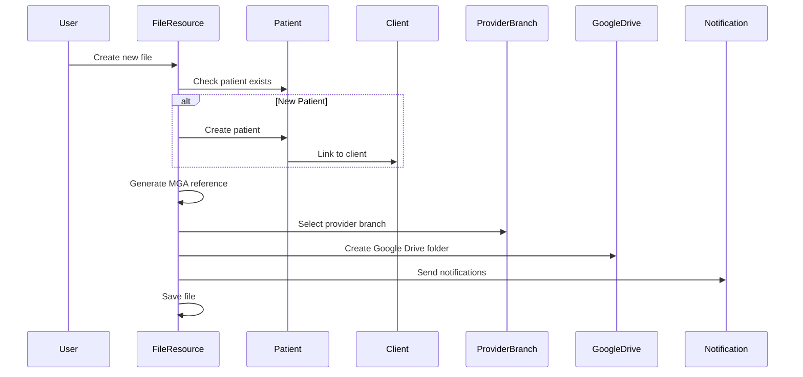

# MGA System Workflow Documentation

> 🛠 Auto-Update Note: This document is automatically generated and maintained by the system workflow generator.

## Table of Contents

1. [Project Overview](#1-project-overview)
2. [Versions & Environment](#2-versions--environment)
3. [Database Schema](#3-database-schema)
4. [Eloquent Models](#4-eloquent-models)
5. [Filament (Panels & Admin UI)](#5-filament-panels--admin-ui)
6. [Livewire Components & Blade](#6-livewire-components--blade)
7. [Routing & Controllers](#7-routing--controllers)
8. [Domain Workflows](#8-domain-workflows)
9. [Jobs, Events, Listeners, Notifications, Mailables, Schedules](#9-jobs-events-listeners-notifications-mailables-schedules)
10. [Policies & Permissions](#10-policies--permissions)
11. [Services & Integrations](#11-services--integrations)
12. [Configuration Highlights](#12-configuration-highlights)
13. [Testing](#13-testing)
14. [Known Limitations & TODOs](#14-known-limitations--todos)

---

## 1. Project Overview

The MGA System is a comprehensive medical assistance and provider relationship management platform built on Laravel 11.4 with Filament 3. The system serves as a centralized hub for managing medical cases, provider networks, client relationships, and financial operations across multiple countries.

**Core Domains:**
- **CRM**: Client and lead management, contact tracking, relationship management
- **PRM**: Provider and branch management, service type coordination, availability tracking
- **Ops**: File/case management, appointment scheduling, medical report handling
- **Workflow**: Task management, interaction tracking, notification systems
- **Finance**: Invoicing, billing, transaction management, payment tracking
- **System**: User management, permissions, audit trails, integrations

**High-level Module Map:**
```
MGA System
├── Client Management (CRM)
│   ├── Companies & Agencies
│   ├── Lead Tracking
│   └── Contact Management
├── Provider Network (PRM)
│   ├── Provider Management
│   ├── Branch Operations
│   └── Service Coordination
├── Case Management (Ops)
│   ├── File Processing
│   ├── Appointment Scheduling
│   └── Medical Documentation
├── Financial Operations
│   ├── Invoicing System
│   ├── Payment Processing
│   └── Transaction Tracking
└── System Administration
    ├── User Management
    ├── Permissions & Roles
    └── Integration Services
```

---

## 2. Versions & Environment

### Core Framework Versions
- **PHP**: ^8.3
- **Laravel**: ^11.31
- **Filament**: ^3.2
- **Livewire**: ^3.0
- **Node.js**: Not specified (Vite-based frontend)
- **Database**: SQLite (development), MySQL/PostgreSQL (production)

### Key Package Versions
| Package | Version | Purpose |
|---------|---------|----------|
| `filament/filament` | ^3.2 | Admin panel framework |
| `filament/infolists` | ^3.2 | Information display components |
| `filament/notifications` | ^3.3 | Notification system |
| `livewire/livewire` | ^3.0 | Reactive components |
| `spatie/laravel-permission` | ^6.16 | Role and permission management |
| `spatie/laravel-google-calendar` | ^3.8 | Google Calendar integration |
| `google/apiclient` | ^2.18 | Google API client |
| `twilio/sdk` | ^8.3 | SMS/WhatsApp messaging |
| `stripe/stripe-php` | ^17.2 | Payment processing |
| `maatwebsite/excel` | ^3.1 | Excel import/export |
| `barryvdh/laravel-dompdf` | ^3.1 | PDF generation |
| `staudenmeir/eloquent-has-many-deep` | ^1.20 | Deep relationship queries |

### Frontend Tooling
- **Vite**: ^6.0.11 (Build tool)
- **Tailwind CSS**: ^3.4.0 (Styling)
- **Axios**: ^1.7.4 (HTTP client)
- **Laravel Vite Plugin**: ^1.2.0 (Laravel integration)

### Development Tools
- **Laravel Blueprint**: ^2.11 (Code generation)
- **Laravel Pint**: ^1.13 (Code formatting)
- **PHPUnit**: ^11.0.1 (Testing)
- **Faker**: ^1.23 (Test data generation)

---

## 3. Database Schema

### Core Tables

#### users
| Column | Type | Nullable | Default | Index/Unique | Foreign Key |
|--------|------|----------|---------|--------------|-------------|
| id | bigint | No | auto_increment | PRIMARY | - |
| name | varchar(255) | No | - | - | - |
| email | varchar(255) | No | - | UNIQUE | - |
| email_verified_at | timestamp | Yes | null | - | - |
| password | varchar(255) | No | - | - | - |
| created_at | timestamp | Yes | null | - | - |
| updated_at | timestamp | Yes | null | - | - |

#### clients
| Column | Type | Nullable | Default | Index/Unique | Foreign Key |
|--------|------|----------|---------|--------------|-------------|
| id | bigint | No | auto_increment | PRIMARY | - |
| company_name | varchar(255) | No | - | - | - |
| type | enum | No | - | - | - |
| status | enum | No | - | - | - |
| initials | varchar(10) | No | - | - | - |
| number_requests | int | No | - | - | - |
| gop_contact_id | bigint | Yes | null | - | → contacts.id |
| operation_contact_id | bigint | Yes | null | - | → contacts.id |
| financial_contact_id | bigint | Yes | null | - | → contacts.id |
| phone | varchar(255) | Yes | null | - | - |
| email | varchar(255) | Yes | null | - | - |
| created_at | timestamp | Yes | null | - | - |
| updated_at | timestamp | Yes | null | - | - |

**Enums:**
- `type`: "Assistance", "Insurance", "Agency"
- `status`: "Searching", "Interested", "Sent", "Rejected", "Active", "On Hold", "Closed", "Broker", "No Reply"

---

## 4. Eloquent Models

### Core Models

#### File Model
```php
class File extends Model
{
    protected $fillable = [
        'status', 'mga_reference', 'patient_id', 'client_reference',
        'country_id', 'city_id', 'service_type_id', 'provider_branch_id',
        'service_date', 'service_time', 'address', 'symptoms', 'diagnosis',
        'contact_patient', 'google_drive_link', 'email', 'phone'
    ];

    // Relationships
    public function patient(): BelongsTo
    public function client(): BelongsTo
    public function country(): BelongsTo
    public function city(): BelongsTo
    public function serviceType(): BelongsTo
    public function providerBranch(): BelongsTo
    public function medicalReports(): HasMany
    public function gops(): HasMany
    public function prescriptions(): HasMany
    public function appointments(): HasMany
    public function comments(): HasMany
    public function tasks(): MorphMany
    public function bankAccounts(): HasMany
    public function bills(): HasMany
    public function invoices(): HasMany
}
```

---

## 5. Filament (Panels & Admin UI)

### Panel Configuration

The system uses two main Filament panels:

1. **Admin Panel** (`filament.admin`) - Main administrative interface
2. **Doctor Panel** (`filament.doctor`) - Specialized interface for telemedicine doctors

### Navigation Groups

#### CRM Group
- **Clients** (`ClientResource`) - Company and agency management
- **Leads** (`LeadResource`) - Lead tracking and conversion
- **Contacts** (`ContactResource`) - Contact information management

#### PRM Group
- **Providers** (`ProviderResource`) - Provider network management
- **Provider Branches** (`ProviderBranchResource`) - Branch operations
- **Branch Services** (`BranchServiceResource`) - Service type pricing
- **Branch Availability** (`BranchAvailabilityResource`) - Availability tracking

#### Ops Group
- **Files** (`FileResource`) - Case/file management
- **Appointments** (`AppointmentResource`) - Appointment scheduling
- **Medical Reports** (`MedicalReportResource`) - Medical documentation
- **Prescriptions** (`PrescriptionResource`) - Prescription management
- **GOPs** (`GopResource`) - Guarantee of Payment management

#### Finance Group
- **Invoices** (`InvoiceResource`) - Client invoicing
- **Bills** (`BillResource`) - Provider billing
- **Transactions** (`TransactionResource`) - Payment tracking
- **Bank Accounts** (`BankAccountResource`) - Banking information
- **Taxes** (`TaxesResource`) - Tax reporting

#### System Group
- **Users** (`UserResource`) - User management
- **Roles** (`RoleResource`) - Role-based permissions
- **Permissions** (`PermissionResource`) - Permission management
- **Teams** (`TeamResource`) - Team organization

---

## 7. Routing & Controllers

### Web Routes

| Method | URI | Controller@Method | Middleware | Name |
|--------|-----|-------------------|------------|------|
| GET | / | Closure | - | - |
| GET | /password | Closure | - | password.form |
| POST | /password | Closure | - | password.submit |
| GET | /redirect-after-login | Closure | - | redirect.after.login |
| GET | /taxes/export | TaxesExportController@export | FilamentAuthenticate | taxes.export |
| GET | /taxes/export/zip | TaxesExportController@exportZip | FilamentAuthenticate | taxes.export.zip |
| GET | /api/cities/{countryId} | Closure | FilamentAuthenticate | - |
| GET | /api/check-email | Closure | FilamentAuthenticate | - |
| POST | /create-meeting | GoogleAuthController@createMeeting | - | google.create-meeting |
| GET | /google/callback | Closure | - | - |
| GET | /gop/{gop} | GopController@view | - | gop.view |
| GET | /invoice/{invoice} | InvoiceController@view | - | invoice.view |
| GET | /prescription/{prescription} | PrescriptionController@view | - | prescription.view |

### API Routes

| Method | URI | Controller@Method | Middleware | Name |
|--------|-----|-------------------|------------|------|
| GET | /api/user | Closure | auth:sanctum | - |
| GET | /api/patients/search-similar | PatientController@searchSimilar | - | - |
| POST | /api/patients/check-duplicate | PatientController@checkDuplicate | - | - |

---

## 8. Domain Workflows

### File Creation Workflow


```mermaid
sequenceDiagram
    participant U as User
    participant F as FileResource
    participant P as Patient
    participant C as Client
    participant PB as ProviderBranch
    participant G as GoogleDrive
    participant N as Notification

    U->>F: Create new file
    F->>P: Check patient exists
    alt New Patient
        F->>P: Create patient
        P->>C: Link to client
    end
    F->>F: Generate MGA reference
    F->>PB: Select provider branch
    F->>G: Create Google Drive folder
    F->>N: Send notifications
    F->>F: Save file
```

---

## 9. Jobs, Events, Listeners, Notifications, Mailables, Schedules

### Mailables

#### AppointmentNotificationMail
```php
class AppointmentNotificationMail extends Mailable
{
    public function build()
    {
        return $this->view('emails.appointment-notification')
                    ->subject('Appointment Notification');
    }
}
```

### Notifications

The system uses Filament notifications for:
- Appointment confirmations
- File status updates
- Payment notifications
- Task assignments

### Console Commands

#### Key Commands
- `AnalyzeContactAssignments` - Analyze contact assignments
- `AutoCategorizeContacts` - Auto-categorize contacts
- `CalculateAppointmentDistances` - Calculate appointment distances
- `CheckBranchContactDetails` - Check branch contact details
- `DebugDistanceCalculation` - Debug distance calculations
- `FixProviderBranchesComprehensiveCommand` - Fix provider branch data

---

## 10. Policies & Permissions

### Permission System

The system uses Spatie Laravel Permission for role-based access control:

#### Roles
- **Admin** - Full system access
- **Telemedicine Doctor** - Limited to doctor panel
- **Operator** - Operational access
- **Financial** - Financial operations access

#### Permissions
- File management permissions
- Client management permissions
- Provider management permissions
- Financial operation permissions
- User management permissions

---

## 11. Services & Integrations

### Google Services

#### Google Calendar Integration
- **Service**: `GoogleCalendarService`
- **Purpose**: Calendar event management
- **Features**: Meeting creation, event scheduling

#### Google Drive Integration
- **Service**: `GoogleDriveFolderService`
- **Purpose**: Document storage and management
- **Features**: Folder creation, file upload, document organization

#### Google Meet Integration
- **Service**: `GoogleMeetService`
- **Purpose**: Video meeting creation
- **Features**: Meeting link generation, conference setup

### Communication Services

#### Twilio Integration
- **Purpose**: SMS and WhatsApp messaging
- **Features**: Appointment notifications, status updates

#### Email Services
- **Provider**: PHPMailer
- **Features**: Custom SMTP configuration per user
- **Templates**: Appointment notifications, invoice delivery

### Payment Services

#### Stripe Integration
- **Purpose**: Payment processing
- **Features**: Online payment links, transaction tracking

### External APIs

#### Required Environment Variables
- `GOOGLE_CLIENT_ID`
- `GOOGLE_CLIENT_SECRET`
- `TWILIO_SID`
- `TWILIO_TOKEN`
- `STRIPE_PUBLIC_KEY`
- `STRIPE_SECRET_KEY`
- `SITE_PASSWORD`

---

## 12. Configuration Highlights

### Key Configuration Changes

#### App Configuration
```php
// config/app.php
'logo' => env('SYSTEM_LOGO', 'public/storage/logo.png'),
```

#### Filament Configuration
- Custom navigation groups
- Role-based panel access
- Custom form components
- Advanced table filtering

#### Mail Configuration
- Custom SMTP per user
- PHPMailer integration
- Template system

#### Queue Configuration
- Database queue driver
- Job retry configuration
- Failure handling

---

## 13. Testing

### Test Structure
- **Feature Tests**: 28 files covering main functionality
- **Unit Tests**: 5 files for isolated component testing
- **Test Framework**: PHPUnit 11.0.1

### Key Test Areas
- File creation and management
- Patient duplicate prevention
- Appointment scheduling
- Financial operations
- API endpoints

---

## 14. Known Limitations & TODOs

### Current Limitations
1. **Distance Calculation**: Limited to basic geographic calculations
2. **File Upload**: No direct file upload interface in Filament
3. **Real-time Updates**: Limited real-time notification system
4. **Mobile Support**: Basic mobile responsiveness

### TODOs
1. **Enhanced Distance Calculation**: Implement advanced geographic algorithms
2. **File Upload Interface**: Add direct file upload to Filament
3. **Real-time Notifications**: Implement WebSocket-based notifications
4. **Mobile App**: Develop mobile application
5. **Advanced Reporting**: Add comprehensive reporting system
6. **API Documentation**: Complete API documentation
7. **Performance Optimization**: Optimize database queries and caching

### Deprecations
- Legacy contact management system
- Old provider branch cost fields
- Basic notification system

---

## Auto-Update Information

This document is automatically generated and maintained by the system workflow generator. The generator:

1. **Scans** all relevant code files for changes
2. **Extracts** metadata and relationships
3. **Updates** this document when changes are detected
4. **Maintains** consistency with the actual codebase

**Last Updated**: 2026-06-30 11:23:20
**Generator Version**: 1.0.0
**Files Monitored**: 200+ files across the application

---

*This documentation is maintained automatically. For manual updates, modify the source code and regenerate using `php artisan system:generate-workflow`.*
